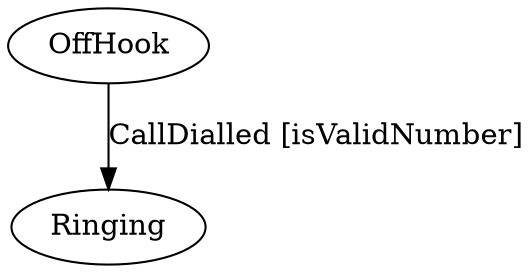

**Create *state machines* and lightweight *state machine-based workflows* directly in JavaScript/TypeScript code:**

```typescript
import { StateMachine } from 'stateless';

const phoneCall = new StateMachine<State, Trigger>(State.OffHook);

phoneCall.configure(State.OffHook)
    .permit(Trigger.CallDialled, State.Ringing);
	
phoneCall.configure(State.Ringing)
    .permit(Trigger.CallConnected, State.Connected);
 
phoneCall.configure(State.Connected)
    .onEntry(() => this.startCallTimer())
    .onExit(() => this.stopCallTimer())
    .permit(Trigger.LeftMessage, State.OffHook)
    .permit(Trigger.PlacedOnHold, State.OnHold);

// ...

phoneCall.fire(Trigger.CallDialled);
assert.equal(State.Ringing, phoneCall.State);
```

This project, as well as the example above, was poring from [Stateless](https://github.com/dotnet-state-machine/stateless) C#.

## Features

Most standard state machine constructs are supported:

 * Generic support for states and triggers of any TypeScript type (numbers, strings, enums, etc.)
 * Hierarchical states
 * Entry/exit events for states
 * Guard clauses to support conditional transitions
 * Introspection

Some useful extensions are also provided:

 * Ability to store state externally (for example, in a property tracked)
 * Parameterised triggers
 * Reentrant states
 * Export to DOT graph

### Hierarchical States


In the example below, the `OnHold` state is a substate of the `Connected` state. This means that an `OnHold` call is still connected.

```typescript
phoneCall.configure(State.OnHold)
    .substateOf(State.Connected)
    .permit(Trigger.TakenOffHold, State.Connected)
    .permit(Trigger.PhoneHurledAgainstWall, State.PhoneDestroyed);
```

In addition to the `StateMachine.state` property, which will report the precise current state, an `isInState(State)` method is provided. `isInState(State)` will take substates into account, so that if the example above was in the `OnHold` state, `isInState(State.connected)` would also evaluate to `true`.

### Entry/Exit Events

In the example, the `startCallTimer()` method will be executed when a call is connected. The `stopCallTimer()` will be executed when call completes (by either hanging up or hurling the phone against the wall.)

The call can move between the `Connected` and `OnHold` states without the `startCallTimer()` and `stopCallTimer()` methods being called repeatedly because the `OnHold` state is a substate of the `Connected` state.

Entry/Exit event handlers can be supplied with a parameter of type `Transition` that describes the trigger, source and destination states.

### External State Storage

Stateless is designed to be embedded in various application models. For example, some ORMs place requirements upon where mapped data may be stored, and UI frameworks often require state to be stored in special "bindable" properties. To this end, the `StateMachine` constructor can accept function arguments that will be used to read and write the state values:

```typescript
const stateMachine = new StateMachine<State, Trigger>({
    accessor: () => this.myState,
    mutator: state => this.myState = sstate});
```

In this example the state machine will use the `myState` object for state storage.

Another example can be found in the JsonExample solution, located in the example folder. 

### Introspection

The state machine can provide a list of the triggers than can be successfully fired within the current state via the `StateMachine.permittedTriggers` property.

### Guard Clauses

The state machine will choose between multiple transitions based on guard clauses, e.g.:

```typescript
phoneCall.configure(State.OffHook)
    .permitIf(Trigger.CallDialled, State.Ringing, () => this.isValidNumber)
    .permitIf(Trigger.CallDialled, State.Beeping, () => !this.isValidNumber);
```

Guard clauses within a state must be mutually exclusive (multiple guard clauses cannot be valid at the same time.) Substates can override transitions by respecifying them, however substates cannot disallow transitions that are allowed by the superstate.

The guard clauses will be evaluated whenever a trigger is fired. Guards should therefor be made side effect free.

Trigger parameters can be used to dynamically select the destination state using the `permitDynamic()` configuration method.

### Ignored Transitions and Reentrant States

Firing a trigger that does not have an allowed transition associated with it will cause an exception to be thrown.

To ignore triggers within certain states, use the `ignore(TTrigger)` directive:

```typescript
phoneCall.configure(State.Connected)
    .ignore(Trigger.CallDialled);
```

Alternatively, a state can be marked reentrant so its entry and exit events will fire even when transitioning from/to itself:

```typescript
stateMachine.configure(State.Assigned)
    .permitReentry(Trigger.Assigned)
    .onEntry(() => this.sendEmailToAssignee());
```

By default, triggers must be ignored explicitly. To override Stateless's default behaviour of throwing an exception when an unhandled trigger is fired, configure the state machine using the `onUnhandledTrigger` method:

```typescript
stateMachine.onUnhandledTrigger((state, trigger) => { });
```

### Export to DOT graph

It can be useful to visualize state machines on runtime. With this approach the code is the authoritative source and state diagrams are by-products which are always up to date.
 
```typescript
phoneCall.configure(State.OffHook)
    .permitIf(Trigger.CallDialled, State.Ringing, isValidNumber);
    
const graph = UmlDotGraph.format(phoneCall.getInfo());
```

It can support to display current state of state machines.

```typescript   
const graph = UmlDotGraph.format(phoneCall.getInfo(), true);
```

The `UmlDotGraph.format()` method returns a string representation of the state machine in the [DOT graph language](https://en.wikipedia.org/wiki/DOT_(graph_description_language)), e.g.:



This can then be rendered by tools that support the DOT graph language, such as the [dot command line tool](http://www.graphviz.org/doc/info/command.html) from [graphviz.org](http://www.graphviz.org) or [viz.js](https://github.com/mdaines/viz.js). See http://www.webgraphviz.com for instant gratification.
Command line example: `dot -T pdf -o phoneCall.pdf phoneCall.dot` to generate a PDF file.

### Async triggers

**Note:** This library support Promise so Async triggers is support well at core of library.

## Building

Stateless runs on JavaScript/TypeScript and practically all modern.

## Project Goals

This page is an almost-complete description of Stateless, and its explicit aim is to remain minimal.

Please use the issue tracker or the if you'd like to report problems or discuss features.

(_Why the name? Stateless implements the set of rules regarding state transitions, but, at least when the delegate version of the constructor is used, doesn't maintain any internal state itself._)
